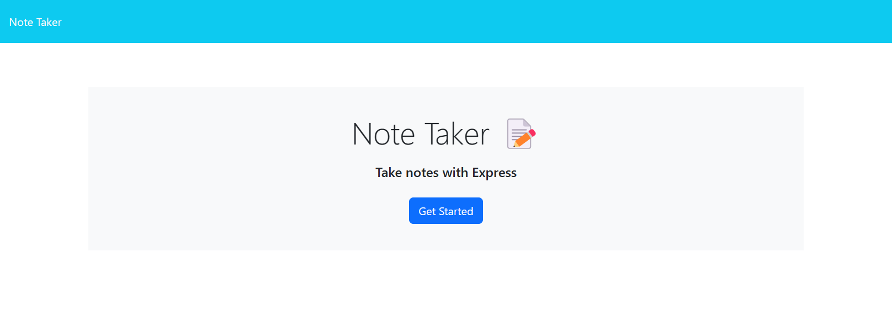
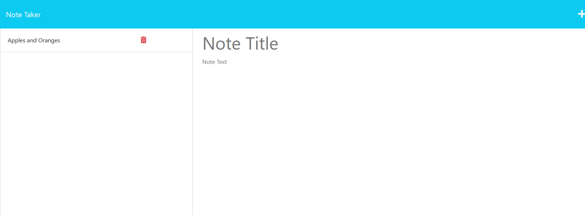

# Essential-note-taker

## Description
This projects main objective was to create a note taker application that could be used by anyone to log daily tasks that they may need or want to complete. Utilizing Express.js, HTML and API routes, Node.js, Javascript, CSS and HTML, not only was this a success, but programming an effective backend was an essential step in its completion.
## Usage
To best use this application, any given user can initiate the program by clicking the get started button and inserting their specific criteria into the notes page. They can also access past notes and delete competed or unwanted inputs. 

[link to running application](https://sheltered-thicket-44511.herokuapp.com/)

## Credits
w3 schools, class
## License
MIT License